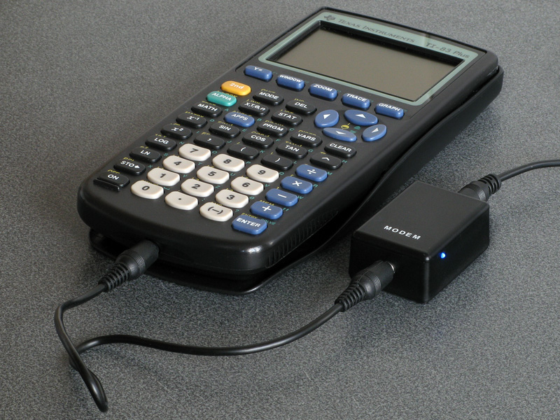
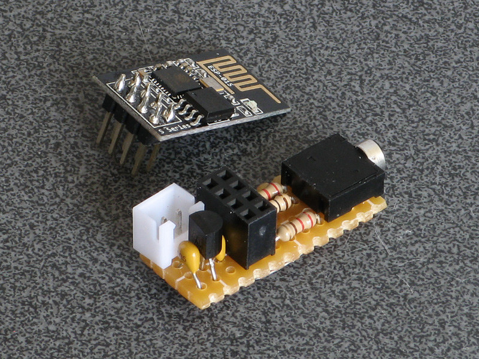
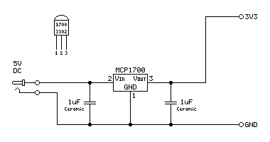
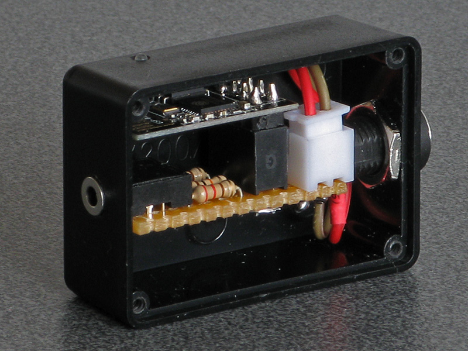

# TIWiFiModem



An ESP8266-based WiFi modem for TI graphical calculators based on [RetroWiFiModem by mecparts](https://github.com/mecparts/RetroWiFiModem/).

## Modem hardware

The modem is based on the [RetroWiFiModem](https://github.com/benryves/RetroWiFiModem/) project.

The original project is designed to interface with a computer via an RS-232 serial port.
As the TI graphical calculator lacks such a port I have written a `TILP` class that implement's the calculator's own link protocol in its place.
This class inherits from the Arduino's `Stream` class and so acts as a drop-in replacement for the `Serial` class.

As this modem is designed to be used with a small pocket calculator I decided to use an ESP-01 module to keep the modem small too.



It is compatible with both the ESP-01 and ESP-01S modules, which share a common pinout:


The firmware can be found in the `TIWiFiModem` directory - open `TIWiFiModem.ino` in the Arduino IDE.
Under Tools&rarr;Board select esp8266&rarr;Generic ESP8266 Module then refer to more specific instructions for the two modules below.

If you have not previously set up the Arduino IDE for use with the ESP8266 then please see the [_ESP8266 core for Arduino_ documentation](https://github.com/esp8266/Arduino#installing-with-boards-manager) for instructions on how to do so.
If you run into any issues relating to missing libraries when building the project then use the Arduino IDE's Library Manager to search for and install them.

### ESP-01

The following circuit diagram shows how the pin connections should be made to the ESP-01:


Pull-up resistors are required on `GPIO0`, `GPIO2`, `CH_PD` and `RST` for the module to boot correctly. The ESP-01 already includes a 12K pull-up resistor on `RST`, but the other three pins need to be pulled up as shown.

Set Tools&rarr;Builtin Led to "1".

### ESP-01S

The following circuit diagram shows how the pin connections should be made to the ESP-01S:


Pull-up resistors are required on `GPIO0`, `GPIO2`, `CH_PD` and `RST` for the module to boot correctly. The ESP-01S already includes a 12K pull-up resistor on `GPIO0`, `CH_PD` and `RST`, so you only need to provide one for `GPIO2`.

Set Tools&rarr;Builtin Led to "2".

### Power supply

The ESP-01/ESP-01S requires a 3.3V supply and reportedly draws up to 170mA of current (in normal operation mine seems to draw around 80mA). A low drop-out 3.3V regulator can be used to supply the circuit from a 5V source (e.g. a USB charger or power bank). The MCP1700 3302 is rated for up to 250mA and does its job well.



### Enclosure

It's a bit of a tight squeeze but I managed to fit the whole circuit into an RX2007 enclosure along with a barrel jack for connection to 5V power.



## Terminal software

Once you have built the modem you will need to have some software on your calculator to communicate with it.
For the TI-83 Plus series I recommend using [Telnet 83 Plus](https://www.ticalc.org/archives/files/fileinfo/141/14141.html) by Justin Karneges and ported to the TI-83 Plus by Dan Englender.
Unfortunately the program doesn't run well on newer calculators with slower display drivers that can't keep up with how fast the program updates the display, so I have included an updated version of [Telnet 83 Plus](/Telnet83Plus) in this project which includes a few bug fixes and new features.
Please see that program's [readme.txt](Telnet83Plus/readme.txt) for further information.

## Getting started

Run the terminal software on your calculator, then plug the modem into your calculator's link port and switch it on. After a few seconds, you should see a message, either

```
OK
```

or

```
ERROR
```

If you don't see any message, try pressing Enter. If that still doesn't seem to do anything, try typing `AT` and pressing Enter (uppercase or lowercase, it doesn't matter) and you should get an `OK` response.

To connect to your Wi-Fi network, you will need to specify the SSID (network name) and password. This can be done by typing

```
AT$SSID=your wifi network name
AT$PASS=your wifi password
```

...pressing Enter after both lines and getting an `OK` response after each.

You can then try to connect by typing

```
ATC1
```

If all is well, the modem should connect to the network and you will receive an `OK` in confirmation. If there is a problem then check your settings and try to reconnect again.
Once you are happy the settings are correct, you can save them by typing

```
AT&W
```

This way the modem should automatically connect to your network next time you restart it, either manually or via the `ATZ` command.

Once you are connected to your Wi-Fi network you can try connecting to an online service.
For example, the [_Level 29_ BBS](https://bbs.fozztexx.com/) can be reached by "dialling":

```
ATDT bbs.fozztexx.com
```

Once the modem has "dialled" and connected you should be able to follow the on-screen instructions to access the BBS.

When you are connected to another device the modem will no longer respond to its own command set.
To return to the local command mode, enter the escape sequence (the default is `+++`) with at least a one second pause before and after the sequence.
You will receive an `OK` confirmation, at which point you can send any desired commands to the modem.
To return to the service you were connected to before, enter the `ATO` command to go back online. Alternatively, use `ATH` to hang up.

As the modem firmware is heavily based on [RetroWiFiModem](https://github.com/benryves/RetroWiFiModem/) please see that project documentation for full documentation of supported commands. Please note that any commands related to the serial port (such as changing baud rate or handshake settings) will have no effect.

## TI-Connecting over the network

TI-Connect is the program that you'd normally use to transfer programs and other data to and from your calculator and a PC with a direct cable connection.
Rather than use this cable between the two devices, we can use the modem to transfer the data wirelessly over the network instead.
Of course, the direct cable connection is much more practical but this way is more entertaining and will hopefully introduce some interesting features of the modem!

### Setting up the modem to accept incoming connections

For this to work, we need to set up the modem to accept incoming connections.
We'll need to know the modem's IP address, hostname or mDNS name to do this.
You can find this information by typing in

```
ATI
```

Now that we know where the modem is on the network, the next thing to do is to specify the port to listen to incoming connections on with `AT$SP`.
For the sake of this example we'll use port 83, so type in:

```
AT$SP=83
AT&W
ATZ
```

`AT$SP` changes the server port setting, `AT&W` saves the settings, and `ATZ` restarts the modem.

At this point, if you use a Telnet client on your PC you should be able to connect to the calculator.
Connect to the calculator using the address you found for it earlier and port 83.
You should find that when your computer tries to open the connection the text "RING" will appear a few times on your calculator screen.
To accept the incoming call, you can quickly type in

```
ATA
```

and press Enter when the line is ringing.

To make life a bit easier for us we'll instead tell the modem to pick up the call after a single ring and save the settings:

```
ATS0=1
AT&W
```

Once you're successfully connected you should find that anything you type on the computer appears on the calculator's screen and anything you type on your calculator appears on your computer's screen.

When you're in a call, you can return to the modem's command mode by entering the escape character three times with a pause of at least one second before and one second after.
This is `+` by default, so type in `+++` and you should be greeted with the `OK` prompt.
At this point you can choose to end the call by hanging up (enter `ATH`) or enter some other commands and then return online with `ATO`.

The last thing we'll need to set up is to disable the modem's use of the Telnet protocol as we'll need a raw data connection.
This can be done with the `ATNET` command, where mode 0 is the raw data mode and mode 1 enables Telnet:

```
ATNET0
```

### Setting up the computer to connect to the calculator's modem

TI-Connect doesn't know that it should be connecting to a calculator over the network, it only supports direct cable connections.
We need to somehow link one of its direct cable connection ports to the calculator's network location.
This can be done in a couple of ways:

* Use a serial modem connected to the computer to connect to the calculator's modem.
* Use a "virtual serial port" driver that transfers data over the network to directly connect to the calculator.

Examples of both solutions are demonstrated below.

#### Using RetroWiFiModem on the PC

We can use [RetroWiFiModem](https://github.com/benryves/RetroWiFiModem) on the PC.
This uses the same firmware as the calculator modem so should be very familiar!

TI-Connect will be looking for a calculator link cable on the serial port with a speed of 9600 baud and no handshaking.
It will also fail to detect the link cable if the CTS line is asserted, so you will either need to use a serial cable that only connects TXD, RXD and GND or have a way to de-assert the CTS line via the modem.

If using the RetroWiFiModem mentioned above, opening a serial terminal and sending this command should dial out to the calculator with appropriate settings:

```
AT $SB=9600 &K0 &CS0 DT -TIWiFiModem:83
```

Replace `TIWiFiModem` with the hostname, mDNS name or IP address of your calculator's own modem.
The minus sign in front of the hostname is also required to give us a raw connection, as this disables the Telnet protocol.

Once you've connected from your serial terminal and can see that you can transfer text between the computer and calculator by typing on their respective keyboards you can close the serial terminal and quit to the calculator's home screen.

#### Using HW Virtual Serial Port

[HW Virtual Serial Port (VSP) 3](https://www.hw-group.com/software/hw-vsp3-virtual-serial-port) can be used to provide a virtual serial port that sends and receives data from a TCP/IP socket.

When the software is installed, go to the Settings tab and log in with the button in the bottom right. Tick the "Purge Buffers when Port is Opened" and "Strict Baudrate Emulation" checkboxes and save the settings.

Now return to the Virtual Serial Port tab and choose a suitable port name.
Enter the hostname or IP address of the port in the "IP Address" field and set the port to 83.

Click "Create COM" and you should see the connection attempt on your calculator.
Once the connection is established you can quit to the calculator's home screen.

### Using TI-Connect

At this point if you run TI-Connect you should find that when it searches for devices it finds your calculator attached with a "Gray Cable".
If you select this device it should be able to take a directory listing of all of the variables on your calculator and you should also to download files from the calculator and take screenshots.

Unfortunately, carrying data like this over the network can introduce delays that TI-Connect does not appear to be expecting and so this setup is not particularly reliable.
I've been able to transfer over 16KB worth of programs with no issues one moment, the next it struggles with a few hundred bytes.
Receiving data, fortunately, seems to be handled somewhat better and I've always been able to take screenshots.

> **Warning** Due to the added unreliability of this link I strongly recommend not using it for anything that writes to the archive: only send programs to RAM, do not try to install applications and certainly don't try to install an OS over the network!
