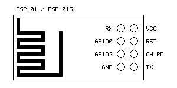
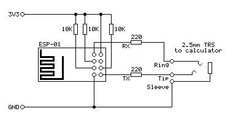
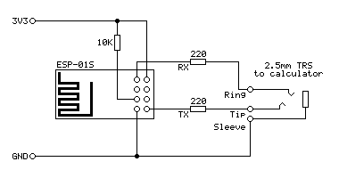

# TIWiFiModem

An ESP8266-based WiFi modem for TI graphical calculators based on RetroWiFiModem

## Modem Hardware

The modem is based on the [RetroWiFiModem](https://github.com/mecparts/RetroWiFiModem/) project.

The original project is designed to interface with a computer via an RS-232 port.
As the TI graphical calculator lacks such a port I have written a `TILP` class that implement's the calculator's own link protocol in its place.
This class inherits from the Arduino's `Stream` class and so acts as a drop-in replacement for the `Serial` class.

As this modem is designed to be used with a small pocket calculator I decided to use an ESP-01 module to keep the modem small too.

It is compatible with both the ESP-01 and ESP-01S modules, which share a common pinout:



The firmware can be found in the `TIWiFiModem` directory - open `TIWiFiModem.ino` in the Arduino IDE.
Under Tools&rarr;Board select esp8266&rarr;Generic ESP8266 Module then refer to more specific instructions for the two modules below.

If you have not previously set up the Arduino IDE for use with the ESP8266 then please see the [_ESP8266 core for Arduino_ documentation](https://github.com/esp8266/Arduino#installing-with-boards-manager) for instructions on how to do so.
If you run into any issues relating to missing libraries when building the project then use the Arduino IDE's Library Manager to search for and install them.

### ESP-01

The following circuit diagram shows how the pin connections should be made to the ESP-01:



Pull-up resistors are required on `GPIO0`, `GPIO2`, `CH_PD` and `RST` for the module to boot correctly. The ESP-01 already includes a 12K pull-up resistor on `RST`, but the other three pins need to be pulled up as shown.

Set Tools&rarr;Builtin Led to "1".

### ESP-01S

The following circuit diagram shows how the pin connections should be made to the ESP-01S:




Pull-up resistors are required on `GPIO0`, `GPIO2`, `CH_PD` and `RST` for the module to boot correctly. The ESP-01S includes a 12K pull-up resistor on `GPIO0`, `CH_PD` and `RST`, so you only need to provide one for `GPIO2`.

Set Tools&rarr;Builtin Led to "2".

## Terminal Software

Once you have built the modem you will need to have some software on your calculator to communicate with it.
For the TI-83 Plus series I recommend using [Telnet 83 Plus](https://www.ticalc.org/archives/files/fileinfo/141/14141.html) by Justin Karneges and ported to the TI-83 Plus by Dan Englender.
Unfortunately the program doesn't run well on newer calculators with slower display drivers that can't keep up with how fast the program updates the display, so I have included an updated version of [Telnet 83 Plus](/Telnet83Plus) in this project which includes a few bug fixes and new features.
Please see that program's [readme.txt](Telnet83Plus/readme.txt) for further information.

## Getting Started

Run the terminal software on your calculator, then plug the modem into your calculator's link port and switch it on. After a few seconds, you should see a message, either

```
OK
```

or

```
ERROR
```

If you don't see any message, try pressing Enter. If that still doesn't seem to do anything, try typing `AT` and pressing Enter (uppercase or lowercase, it doesn't matter) and you should get an `OK` response.

To connect to your Wi-Fi network, you will need to specify the SSID (network name) and password. This can be done by typing

```
AT$SSID=your wifi network name
AT$PASS=your wifi password
```

...pressing Enter after both lines and getting an `OK` response after each.

You can then try to connect by typing

```
ATC1
```

If all is well, the modem should connect to the network and you will receive an `OK` in confirmation. If there is a problem then check your settings and try to reconnect again.
Once you are happy the settings are correct, you can save them by typing

```
AT&W
```

This way the modem should automatically connect to your network next time you restart it, either manually or via the `ATZ` command.

Once you are connected to your Wi-Fi network you can try connecting to an online service.
For example, the [_Level 29_ BBS](https://bbs.fozztexx.com/) can be reached by "dialling":

```
ATDT bbs.fozztexx.com
```

Once the modem has "dialled" and connected you should be able to follow the on-screen instructions to access the BBS.

When you are connected to another device the modem will no longer respond to its own command set.
To return to the local command mode, enter the escape sequence (the default is `+++`) with at least a one second pause before and after the sequence.
You will receive an `OK` confirmation, at which point you can send any desired commands to the modem.
To return to the service you were connected to before, enter the `ATO` command to go back online. Alternatively, use `ATH` to hang up.

As the modem firmware is heavily based on [RetroWiFiModem](https://github.com/mecparts/RetroWiFiModem/) please see that project documentation for full documentation of supported commands. Please note that any commands related to the serial port (such as changing baud rate or handshake settings) will have no effect.
